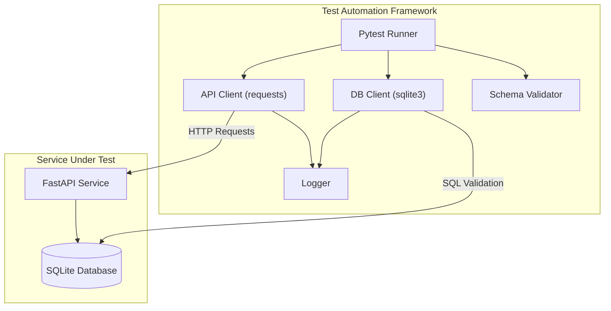
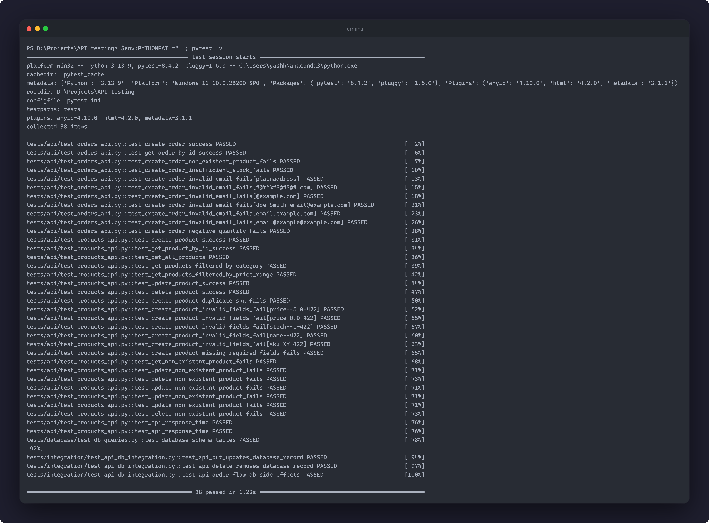
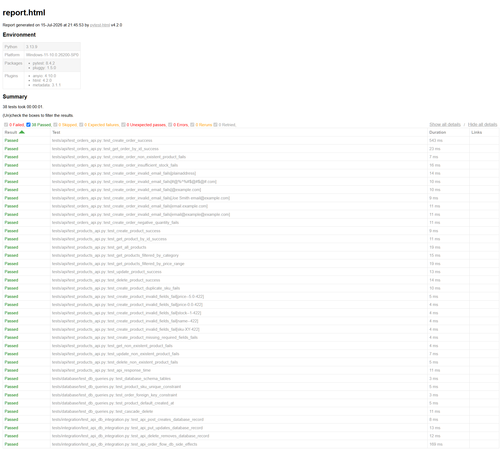
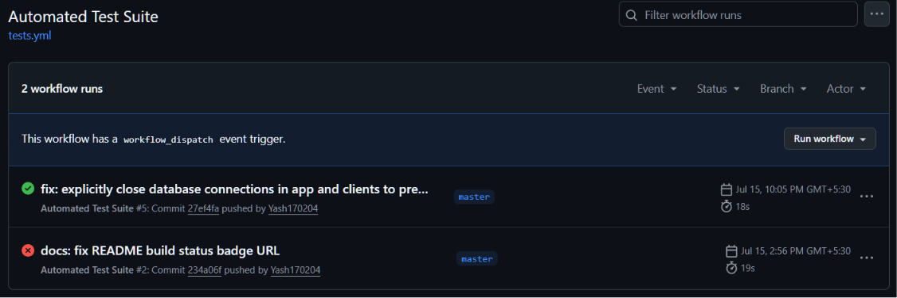

# API & Database Test Automation Framework

[](https://github.com/Yash170204/API-Database-Test-Automation-Framework/actions/workflows/tests.yml)
[](https://opensource.org/licenses/MIT)
[](https://www.python.org/)

A production-quality, portfolio-ready **API & Database Test Automation Framework** written in Python using **Pytest**. 

This repository demonstrates professional SDET (Software Development Engineer in Test) practices including structured framework architecture, request/response payload validation, database consistency testing (API-to-DB), error boundary validation, centralized logging, and automated execution in a GitHub Actions CI/CD pipeline.

---

## Overview

In modern microservice architectures, validating RESTful APIs alone is insufficient. Data synchronization bugs, race conditions, or incorrect database triggers can occur even if the API returns a `200 OK` status. 

This framework solves that problem by implementing **dual-layer verification**:
1. **API Validation**: Verifies HTTP headers, response codes, payload structures (JSON schema compliance), and response times.
2. **Database Integrity**: Connects directly to the backend SQL database to query records and verify that mutations (inserts, updates, deletes) are accurately reflected in the database state, and verifies backend side-effects (e.g. placing an order decreases product stock).

---

## Key Features

- **Self-Contained Architecture**: Includes a local FastAPI inventory service backed by SQLite. Pytest dynamically spins up this server in a background thread on a dynamic port during execution—requiring zero external server configuration.
- **30 Functional Test Scenarios**: Includes CRUD coverage, filtering, boundary value checks, and negative test validations.
- **Robust API Client**: Wraps the Python `requests` library with unified logging, custom header support, and elapsed-time latency monitors.
- **Database Consistency Testing**: Direct SQL queries using parameterized scripts via a SQLite DB wrapper to assert exact field matches and verify foreign key cascades.
- **JSON Schema Validation**: Automatically validates response payloads against static drafts to ensure data contract enforcement.
- **Automated HTML Reporting**: Generates interactive test reports including statistics, pass/fail counts, and execution logs.
- **CI/CD Integration**: Automatically executes tests on every commit/PR and archives reports as artifacts.

---

## Tech Stack

- **Testing Tool**: `pytest`
- **HTTP Client**: `requests`
- **Target Service**: `FastAPI` (Uvicorn ASGI server)
- **Database**: SQLite (`sqlite3` wrapper)
- **Schema Validation**: `jsonschema`
- **CI/CD**: GitHub Actions
- **Configuration**: `python-dotenv`
- **Reporting**: `pytest-html`

---

## Architecture Diagram



---

## Project Structure

```
api-database-test-automation/
├── .github/
│   └── workflows/
│       └── tests.yml      # CI/CD pipeline configuration
├── config/
│   └── settings.py        # Central configuration settings manager
├── docs/
│   └── SCREENSHOTS.md     # Guidelines for capturing showcase screenshots
├── schemas/
│   ├── order_schema.json  # JSON schema for order response validation
│   └── product_schema.json# JSON schema for product response validation
├── src/
│   ├── api/
│   │   └── api_client.py  # Central HTTP Requests client
│   ├── app/
│   │   ├── database.py    # Schema initialization for the target service
│   │   └── main.py        # Target FastAPI service endpoints
│   ├── database/
│   │   └── db_client.py   # Parameterized SQL database execution client
│   └── utils/
│       ├── helpers.py     # JSON schema load and validation helpers
│       └── logger.py      # Console & file logger setup
├── tests/
│   ├── api/
│   │   ├── test_orders_api.py   # Orders functional API tests
│   │   └── test_products_api.py # Products functional API tests
│   ├── database/
│   │   └── test_db_queries.py   # Direct database constraints & structure tests
│   ├── integration/
│   │   └── test_api_db_integration.py # API-to-Database consistency validations
│   └── conftest.py        # Pytest fixtures (background server, database, clients)
├── .env.example           # Configuration environment variables template
├── .gitignore             # Git exclusion rules
├── LICENSE                # MIT License terms
├── pytest.ini             # Pytest framework settings and markers
└── requirements.txt       # Python dependencies list
```

---

## Test Coverage

The suite contains **30 automated tests** categorized into distinct test groups:

| Category | Target Component | Coverage Description |
|----------|------------------|----------------------|
| **API** | `products` API | CRUD validation, category filters, price boundary filters, header validation, latency limits. |
| **API** | `orders` API | Order placement, negative checks (quantity <= 0), email syntax validation. |
| **Schema** | Contract Validation | JSON schema type, requirement, and formatting checks against API response payloads. |
| **Database** | SQL Constraints | Schema checks, unique constraints (duplicate SKUs), foreign keys (non-existent products), table column presence. |
| **Integration** | API-to-DB Consistency | Asserts that creations, updates, and deletes via the API reflect identical database row values. |
| **Integration** | DB Side-Effects | Verifies business logic side-effects: placing an order successfully decrements inventory stock. |

---

## Getting Started

### Prerequisites
- Python 3.9 or higher
- Git

### Installation

1. **Clone the Repository:**
   ```bash
   git clone https://github.com/your-username/api-database-test-automation.git
   cd api-database-test-automation
   ```

2. **Create and Activate a Virtual Environment:**
   * **Windows:**
     ```bash
     python -m venv venv
     .\venv\Scripts\activate
     ```
   * **macOS/Linux:**
     ```bash
     python3 -m venv venv
     source venv/bin/activate
     ```

3. **Install Dependencies:**
   ```bash
   pip install -r requirements.txt
   ```

4. **Initialize Environment Variables:**
   Create a local `.env` file from the template (optional, fallback values are configured):
   ```bash
   copy .env.example .env
   ```

---

## Running Tests

Run the tests using standard `pytest` commands. The framework automatically handles starting and stopping the FastAPI application in the background.

* **Run all tests:**
  ```bash
  pytest -v
  ```

* **Run only API tests:**
  ```bash
  pytest -m api -v
  ```

* **Run only database validation tests:**
  ```bash
  pytest -m database -v
  ```

* **Run only API-to-DB integration tests:**
  ```bash
  pytest -m integration -v
  ```

* **Run smoke tests:**
  ```bash
  pytest -m smoke -v
  ```

---

## Test Reports

The framework is configured to generate clean HTML test reports. 

Generate the report locally:
```bash
pytest --html=reports/report.html --self-contained-html
```

Open `reports/report.html` in any web browser to view the interactive test suite dashboard, showing pass rates, execution durations, and step-by-step logs.

---

## CI/CD with GitHub Actions

The continuous integration pipeline is defined in `.github/workflows/tests.yml`. On every `push` and `pull_request` to `master`/`main` branches, it:
1. Provisions a clean Ubuntu environment.
2. Caches and installs pip dependencies.
3. Spins up the application and runs all tests.
4. Generates the self-contained HTML report.
5. Archives and uploads the HTML report as an artifact (`test-execution-report`) downloadable on GitHub.

---

## Screenshots / Demo


### 1. Full Automated Test Suite Passing


### 2. Interactive HTML Report Dashboard


### 3. GitHub Actions CI Pipeline Run


---

## What I Learned / Engineering Decisions

- **Daemon Threading for App Lifecycles**: Spawning the FastAPI server inside a session-scoped fixture using a background python thread eliminates the need to coordinate complex external startup scripts.
- **Dynamic Port Selection**: Finding a free socket port before launching uvicorn prevents port-binding failures and makes tests highly concurrent-friendly.
- **Transactional Database Fixtures**: Setting a function-scoped DB cleanup fixture ensures that even if tests fail midway, database states are consistently purged before the next test, preventing data contamination.
- **Schema Separation**: Decoupling the Pydantic schemas in the target service from the JSON schemas in the test layer prevents "testing mirror configurations," ensuring a genuine contract check.

---

## Future Improvements

- **Dockerization**: Containerize both the target service and test suite using Docker Compose to test on containerized networking.
- **Parallel Test Execution**: Integrate `pytest-xdist` to run tests concurrently for faster CI cycles.
- **Database Migrations**: Add Alembic to manage database migrations and test migration schema validations.
